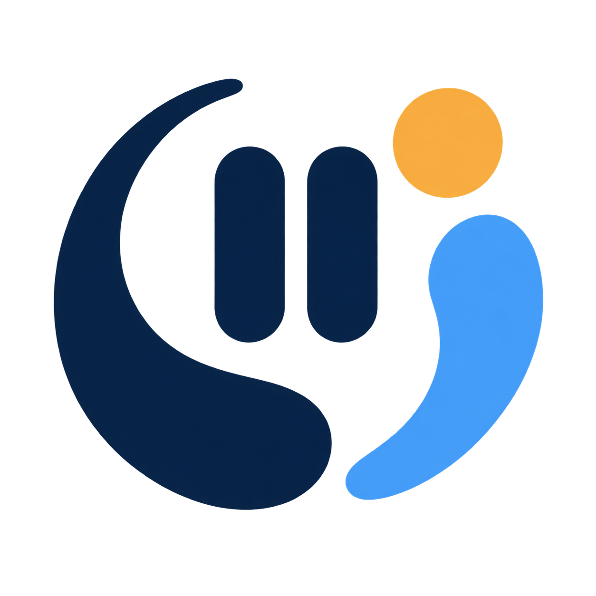

# GazeBreak

A tiny macOS menu-bar app that helps prevent long, uninterrupted screen sessions.



GazeBreak is named for the small, intentional pause it creates in a long period of close-focus work. The abstract mark represents an opening and breathing room rather than a literal eye or medical symbol.

GazeBreak is licensed under the [Apache License 2.0](LICENSE).

## Install with Homebrew

The easiest way to install GazeBreak is through [Homebrew](https://brew.sh/) and the [GazeBreak tap](https://github.com/apil-khadka/homebrew-tap). The tap’s [cask definition](https://github.com/apil-khadka/homebrew-tap/blob/main/Casks/gazebreak.rb) installs the app into Applications:

```bash
brew tap apil-khadka/tap
brew install --cask gazebreak
```

To update it later:

```bash
brew update
brew upgrade --cask gazebreak
```

To uninstall:

```bash
brew uninstall --cask gazebreak
```

The tap currently serves the stable Apple Silicon (`arm64`) cask. Intel support will be available when the tap moves to the stable universal release. For manual downloads, use the [GitHub Releases page](https://github.com/apil-khadka/gazebreak/releases).

## Build a release locally

```bash
./scripts/package-release.sh
```

This creates a universal `dist/GazeBreak.app` and `dist/GazeBreak-macOS-universal.zip`. Local builds use ad-hoc signing unless `SIGNING_IDENTITY` is provided. The production GitHub Actions workflow supplies the Developer ID certificate and App Store Connect API key through GitHub Secrets, then notarizes and staples the app before publishing.

## Production releases

Push a semantic version tag such as `v0.1.1` to run `.github/workflows/release.yml`. The workflow requires these repository secrets and never stores their values in the repository:

- `DEVELOPER_ID_APPLICATION_P12_BASE64`
- `DEVELOPER_ID_APPLICATION_P12_PASSWORD`
- `APPLE_API_KEY_P8_BASE64`
- `APPLE_API_KEY_ID`
- `APPLE_API_ISSUER_ID`
- `APPLE_TEAM_ID`

The published `GazeBreak-macOS-universal.zip` contains only `GazeBreak.app`; its adjacent `.sha256` file contains the checksum used by a Homebrew cask.

For an experimental self-signed build, push a tag such as `self-v0.1.1`. The self-signed workflow publishes a prerelease with the same universal filename and checksum, but it is ad-hoc signed, not notarized, and not trusted by Gatekeeper. It is not suitable for a normal end-user Homebrew cask.

## Run

1. Open the folder in Xcode.
2. Choose the `GazeBreak` executable scheme.
3. Run it on **My Mac**.

For a deterministic timer smoke test, run `swift run GazeBreak --self-test`. It exercises countdown advancement, the reminder boundary, and break completion without waiting 20 minutes.

The app is an accessory app, so it stays out of the Dock and lives in the menu bar. Click the eye and timer pill to pause, reset, change the interval, or change the break length.

The default timing is a 20-minute focus interval followed by a 30-second distance break. The reminder window is a floating panel that stays visible above other windows and across Spaces. Settings persist between launches, and the timer pauses when the macOS session becomes inactive.

After roughly two hours of accumulated focus time, the app shows a longer 15-minute reset. Short-break skips do not erase that accumulated focus time; the Reset button starts the two-hour cycle over.

The app does not diagnose or treat eye conditions. It is a reminder tool based on common digital-eye-strain guidance. If you have persistent symptoms or sudden flashes, a sudden increase in floaters, or a curtain/shadow in your vision, contact an eye-care professional promptly.
